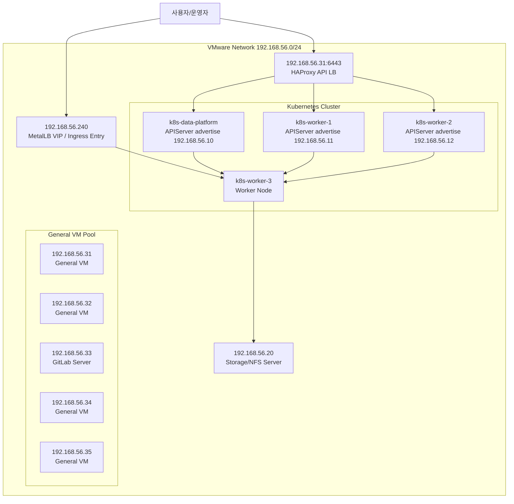

# VMware

| 항목 | 값 |
|---|---|
| 하이퍼바이저 | VMware |
| Control Plane | `k8s-data-platform`, `k8s-worker-1`, `k8s-worker-2` |
| Worker | `k8s-worker-3` |
| Kubernetes API Endpoint (현재 운영) | `https://192.168.56.31:6443` |
| Kubernetes API Endpoint (권장 최종형) | 별도 VIP 예: `https://192.168.56.241:6443` |
| General VM | `192.168.56.20`, `192.168.56.31`, `192.168.56.32`, `192.168.56.34~35` |
| MetalLB EIP | `192.168.56.240` |

## 시스템 구성도



## 최상위 폴더 구성

| 폴더 | 구성 내용 | 비고 |
|---|---|---|
| `applications/` | 앱 소스(backend/frontend/router/jupyter) | 빌드/이미지 생성 대상 |
| `manifests/` | Kubernetes 배포 매니페스트 원본 | dev/prod 오버레이 포함 |
| `infra/` | VM IP별 인벤토리 문서 | `server종류.md` 11개 |

## applications 구성 상세

| 경로 | 역할 | 실행/빌드 핵심 |
|---|---|---|
| `applications/fss-dis-server-node` | DIS 거버넌스 API 서버 | Node.js 22, Express 5 |
| `applications/fss-dis-frontend` | DIS 프론트엔드 | Vue 3, Quasar, Vite |
| `applications/jupyter-pod-router` | Jupyter named pod 라우터 | Node.js 22, http-proxy |
| `applications/jupyter` | 사용자 Jupyter 이미지 베이스 | JupyterLab, pandas, teradatasql |

## manifests 구성 상세

| 경로 | 역할 | 주요 파일 |
|---|---|---|
| `manifests/fss/base` | 공통 리소스 베이스 | `dis-app.yaml`, `dynamic-routing.yaml`, `mongodb.yaml`, `redis.yaml` |
| `manifests/fss/overlays/dev` | 개발 환경 오버레이 | `local-pv.yaml`, `metallb-ip-pool.yaml`, `ingress-nginx-lb.yaml` |
| `manifests/fss/overlays/prod` | 운영 환경 오버레이 | `infra-scale-patch.yaml` |
| `manifests/platform` | 클러스터 공통 플랫폼 | `calico.yaml`, `ingress-nginx.yaml`, `metallb-native.yaml`, `metrics-server.yaml` |
| `manifests/apps` | 앱 단위 개별 매니페스트 | `headlamp-app.yaml`, `headlamp-offline.yaml` |
| `manifests/addons` | 선택 애드온 | `teradata-mock-postgres.yaml` |
| `manifests/storage` | 스토리지 검증 리소스 | `rook-ceph-over-nfs/*.yaml` |
| `manifests/samples` | 샘플 워크로드 | `jupyter-samples.yaml` |

## 기술 스택

| 영역 | 스택 |
|---|---|
| Backend (DIS) | Node.js 22, Express 5, Socket.io, Mongoose, ioredis, `@kubernetes/client-node` |
| Frontend | Vue 3, Quasar, Vite, Axios, Chart.js, AG Grid |
| Router | Node.js 22, Express 5, http-proxy |
| Data/Batch | JupyterLab, pandas |
| Kubernetes | Kustomize overlays(dev/prod), Ingress-NGINX, MetalLB, Calico, Metrics Server |
| Data Services | MongoDB, Redis, NFS (`192.168.56.20`) |

## 목표 클러스터 토폴로지

- `k8s-data-platform`, `k8s-worker-1`, `k8s-worker-2` 를 `kubeadm` stacked etcd 기반 control plane 으로 운영
- `k8s-worker-3` 는 워크로드 전용 worker 로 유지
- 현재 kubeadm `controlPlaneEndpoint` 는 `192.168.56.31:6443`
- `192.168.56.31` 은 `nexus-31` VM 위의 단일 `HAProxy` API LB 로 사용 중
- `192.168.56.240` 은 계속 MetalLB/Ingress 진입점으로만 사용하고, control plane API endpoint 와 혼용하지 않음
- 최종적으로는 `192.168.56.31` 단일 LB 대신 별도 VIP 예: `192.168.56.241:6443` + `keepalived/HAProxy` 이중화를 권장

## 2026-04-23 전환 결과

2026-04-23 기준 실제 전환 작업으로 단일 control plane 에서 3-control-plane 구조로 확장했다.

| 노드명 | 역할 | APIServer advertise 주소 | 현재 확인된 상태 |
|---|---|---|---|
| `k8s-data-platform` | Control Plane 1 | `192.168.56.10` | Ready |
| `k8s-worker-1` | Control Plane 2 | `192.168.56.11` | Ready |
| `k8s-worker-2` | Control Plane 3 | `192.168.56.12` | Ready |
| `k8s-worker-3` | Worker | 없음 | Ready |
| `nexus-31` | 단일 API LB | `192.168.56.31:6443` | Ready |

핵심 반영 사항:

- `kubeadm-config` 의 `controlPlaneEndpoint` 를 `192.168.56.31:6443` 로 변경
- CP1 `apiserver.crt` SAN 에 `192.168.56.31`, `192.168.56.10`, `192.168.56.11`, `192.168.56.12` 반영
- `k8s-worker-1`, `k8s-worker-2` 를 `kubeadm join --control-plane` 흐름으로 승격
- stacked etcd 3-member 구성 완료
- `k8s-worker-1`, `k8s-worker-2` 의 learner member 는 수동 promote 로 안정화
- `k8s-worker-1` 은 `containerd` + `kubelet` 재시작 후 CNI 초기화가 완료되어 `Ready` 전환 확인
- `k8s-worker-2` 도 동일 패턴으로 CP3 합류 완료

## 현재 접속 기준

- WSL 또는 관리자 단말의 `kubectl` 은 `https://192.168.56.31:6443` 를 보도록 맞추는 것을 권장
- `~/.kube/config` 가 여전히 `https://192.168.56.10:6443` 를 보면 LB 경유가 아니라 CP1 직접 접속 상태다
- `k8s-worker-*` 노드의 로컬 `kubectl` 이 예전 테스트용 주소 `192.168.233.128:6443` 를 보면 `/etc/kubernetes/admin.conf` 기준으로 다시 복사해야 한다

예시:

```bash
grep server: ~/.kube/config
```

## 배포 명령

| 환경 | 명령 |
|---|---|
| Dev | `kubectl apply -k manifests/fss/overlays/dev` |
| Prod | `kubectl apply -k manifests/fss/overlays/prod` |

## 주요 접속

| 서비스 | URL |
|---|---|
| Ingress VIP | `http://192.168.56.240/` |
| Platform Portal (`hosts` 별칭 선택) | `http://192.168.56.240/` 또는 `http://platform.local/` |
| Headlamp | `http://192.168.56.240/headlamp-dashboard/?lng=en` |
| Kubernetes API (현재) | `https://192.168.56.31:6443` |
| Kubernetes API (권장 최종형) | `https://<control-plane-vip>:6443` |

호스트 기반 DNS ingress는 사용하지 않는다. 사용자가 `.local` 별칭으로 접속하려면 관리자 PC의 `hosts` 파일에 예시처럼 등록한다.

```txt
192.168.56.240 platform.local
192.168.56.31 nexus.local
https://192.168.56.32
```

## INTERNAL-IP 정리 메모

3-control-plane 전환 과정에서 `k8s-worker-1`, `k8s-worker-2`, `k8s-worker-3` 는 기존 kubelet `--node-ip` 값 때문에 `10.110.2.x` 대역으로 `InternalIP` 가 남아 있을 수 있다.

현재 구조는 다음처럼 혼합될 수 있다.

- control plane advertise 주소: `192.168.56.10`, `192.168.56.11`, `192.168.56.12`
- node `InternalIP`: `10.110.2.216`, `10.110.2.217`, `10.110.2.218`

운영 단순화를 위해 아래 목표값으로 통일하는 것을 권장한다.

| 노드명 | 목표 InternalIP |
|---|---|
| `k8s-worker-1` | `192.168.56.11` |
| `k8s-worker-2` | `192.168.56.12` |
| `k8s-worker-3` | `192.168.56.13` |

적용 방법:

```bash
echo 'KUBELET_KUBEADM_ARGS="--node-ip=<target-ip>"' | sudo tee /var/lib/kubelet/kubeadm-flags.env
sudo systemctl restart kubelet
```

적용 후 확인:

```bash
kubectl get nodes -o wide
kubectl describe node <node-name> | sed -n '/Addresses:/,/Conditions:/p'
```

참고:

- `InternalIP` 는 kubelet의 `--node-ip` 값에 따라 결정됨
- `apiserver advertiseAddress` 와 `InternalIP` 는 같은 개념이 아님
- `controlPlaneEndpoint` 를 `192.168.56.31:6443` 로 바꿨더라도 node `InternalIP` 는 자동으로 바뀌지 않음
- `kubeadm` 은 이런 node-level 재구성을 자동으로 해주지 않으므로 로컬 파일 수정과 kubelet 재시작이 필요함

## etcd 백업 운영

- 3-control-plane 환경에서는 각 CP 노드가 stacked `etcd` member 를 하나씩 가지므로 정기 snapshot 백업이 필요함
- 로컬 원본 스크립트: [`scripts/etcd-backup.sh`](/home/ubuntu/k8s-fss/scripts/etcd-backup.sh)
- control plane 실행 경로 예: `192.168.56.10` 의 `/home/ubuntu/etcd-tools/etcd-backup.sh`
- 관련 도구 위치:
  - 각 control plane 의 `/home/ubuntu/etcd-tools/etcdctl`
  - 각 control plane 의 `/home/ubuntu/etcd-tools/etcdutl`
- 기본 동작:
  - 기본 endpoint 는 `https://127.0.0.1:2379`
  - 필요 시 `ENDPOINTS=https://127.0.0.1:2379,https://<peer-ip>:2379` 처럼 다중 endpoint 지정 가능
  - 실제 백업 저장 위치는 실행한 control plane 의 `/var/backups/etcd`
  - `.db.gz` 압축 백업 저장
  - `.sha256` 체크섬 생성
  - 7일 초과 백업 파일 자동 삭제
  - 호스트에 `etcdctl` 이 없으면 해당 control plane 의 `containerd` 캐시 etcd 이미지로 fallback 실행
- 운영 원칙:
  - snapshot 은 control plane 3대 모두에서 같은 cron 으로 돌리기보다, 우선 1대에서 시작하고 주기적 복제 여부를 별도로 결정
  - 복원은 단일 노드 restore 가 아니라 etcd quorum 을 고려한 장애조치 절차로 수행
- 2026-04-20 기준 단일 CP 검증 완료:
  - CP `192.168.56.10` 에서 스크립트 직접 실행 성공
  - `/var/backups/etcd` 에 snapshot 생성 성공
  - 최신 snapshot 으로 임시 경로 restore 테스트 성공
  - live `/var/lib/etcd` 교체는 수행하지 않음

3-CP 전환 절차와 API VIP 설계는 [`infra/control-plane-ha.md`](/home/ubuntu/k8s-fss/infra/control-plane-ha.md) 참고

수동 실행:

```bash
ssh ubuntu@<control-plane-node>
sudo /home/ubuntu/etcd-tools/etcd-backup.sh
```

보관 기간/경로 변경 예:

```bash
sudo BACKUP_DIR=/data/etcd-backups RETENTION_DAYS=14 /home/ubuntu/etcd-tools/etcd-backup.sh
```

crontab 예시:

```bash
sudo crontab -e
```

```cron
0 2 * * * /home/ubuntu/etcd-tools/etcd-backup.sh >> /var/log/etcd-backup.log 2>&1
```

- 백업 로그 경로: 실행한 control plane 의 `/var/log/etcd-backup.log`
- 로그 회전 설정 경로: 실행한 control plane 의 `/etc/logrotate.d/etcd-backup`
- 권장 로그 회전 정책:
  - daily
  - `rotate 14`
  - compress
  - missingok
  - notifempty
- 2026-04-20 기준 `logrotate -f /etc/logrotate.d/etcd-backup` 강제 회전 테스트 완료

복원 기본 절차:

```bash
sudo gunzip -c /var/backups/etcd/etcd-snapshot-YYYY-MM-DD-HHMMSS.db.gz > /tmp/etcd-restore.db
sudo /home/ubuntu/etcd-tools/etcdutl snapshot restore /tmp/etcd-restore.db --data-dir /var/lib/etcd-restore
```

- 복원 전 기존 `/var/lib/etcd` 는 반드시 별도 백업
- restore 후 control plane 노드의 `/etc/kubernetes/manifests/etcd.yaml` 에서 `data-dir` 사용 경로와 실제 운영 절차를 환경에 맞게 조정 필요
- 실무에서는 snapshot 파일을 NAS/NFS 같은 별도 스토리지에도 함께 복사 권장
- 백업은 배치로 자동화 가능하지만, 복원은 수동 장애조치 절차임
- 테스트용 임시 경로 예:
  - `/tmp/etcd-restore-from-script.db`
  - `/tmp/etcd-restore-from-script`
  - 운영 백업 위치인 `/var/backups/etcd` 와 구분해서 사용
- stacked etcd 3노드 환경에서는 restore 전에 반드시 `member list`, quorum 상태, 어떤 노드를 기준으로 재구성할지 먼저 결정

장애 시 최소 복원 순서:

1. 기존 `/var/lib/etcd` 를 다른 경로로 백업
2. 최신 snapshot 을 `/tmp/etcd-restore.db` 로 압축 해제
3. `/home/ubuntu/etcd-tools/etcdutl snapshot restore ... --data-dir <restore-dir>` 실행
4. `/etc/kubernetes/manifests/etcd.yaml` 의 `data-dir` 를 복구 디렉터리로 맞추거나 복구 결과를 운영 경로로 교체
5. 3-CP 환경이면 나머지 member 재조인 또는 재구성을 포함해 quorum 복구
6. `etcd`, `kube-apiserver`, `kubectl get nodes` 순서로 정상화 확인

## 운영 메모

- 현재 API LB 는 `nexus-31` 단일 HAProxy 이므로 SPOF 이다
- 장기 운영형으로는 `192.168.56.34`, `192.168.56.35` 같은 일반 VM 에 `keepalived + HAProxy` 를 분리 배치하는 것을 권장
- control plane 노드(`k8s-worker-1`, `k8s-worker-2`)에 테스트용 `haproxy`/`keepalived` 가 남아 있으면 반드시 비활성화 상태를 유지
- control plane 추가 후 `kubeadm join` 이 중간 실패하면 `/etc/kubernetes/manifests/*.yaml` 잔재, `haproxy`의 `6443` 점유, `2379/2380` 방화벽 경로를 먼저 확인
- `kubeadm reset` 은 `/etc/cni/net.d` 를 자동 정리하지 않으므로, reset 뒤 재조인 전 `sudo rm -rf /etc/cni/net.d` 를 수행해야 함
- `k8s-worker-1`, `k8s-worker-2` 에서 `Ready=False` 와 `NetworkPluginNotReady` 가 보이면 `containerd` 와 `kubelet` 재시작으로 CNI 재초기화가 필요할 수 있음

## 검증 명령

```bash
kubectl get nodes -o wide
kubectl get svc -A
kubectl get ingress -A
kubectl get pods -n kube-system -o wide
sudo ETCDCTL_API=3 etcdctl \
  --endpoints=https://127.0.0.1:2379 \
  --cacert=/etc/kubernetes/pki/etcd/ca.crt \
  --cert=/etc/kubernetes/pki/apiserver-etcd-client.crt \
  --key=/etc/kubernetes/pki/apiserver-etcd-client.key \
  member list -w table
```
