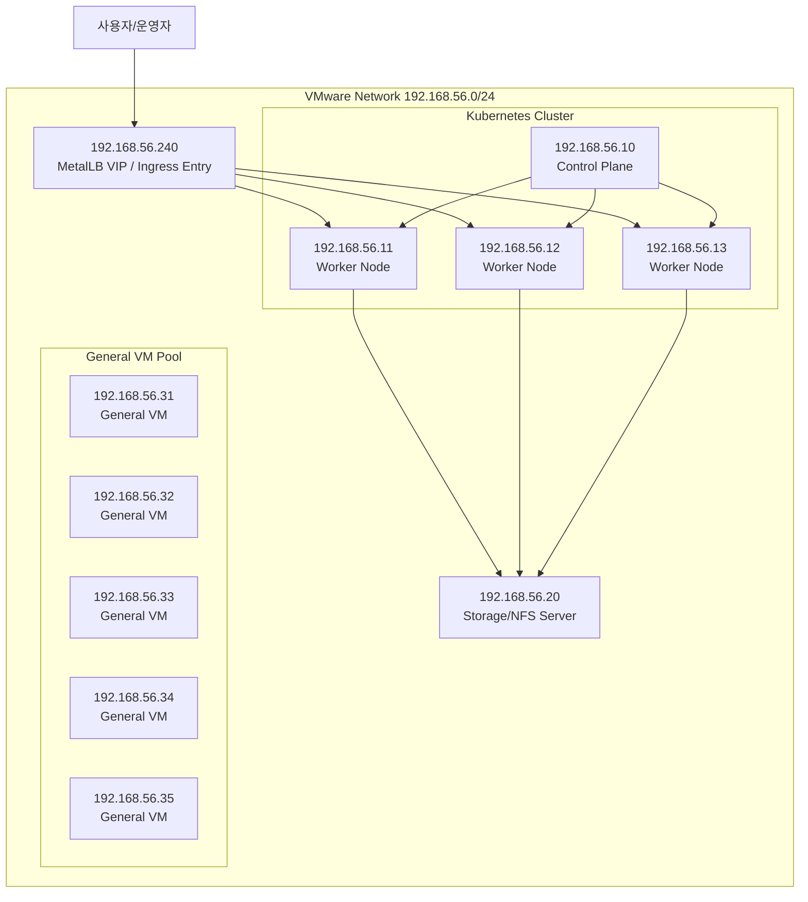

# k8s-fss (VMware)

| 항목 | 값 |
|---|---|
| 하이퍼바이저 | VMware |
| Control Plane | `192.168.56.10` |
| Worker | `192.168.56.11~13` |
| General VM | `192.168.56.20`, `192.168.56.31~35` |
| MetalLB EIP | `192.168.56.240` |

## 시스템 구성도



## 최상위 폴더 구성

| 폴더 | 구성 내용 | 비고 |
|---|---|---|
| `applications/` | 앱 소스(backend/frontend/router/jupyter/airflow) | 빌드/이미지 생성 대상 |
| `manifests/` | Kubernetes 배포 매니페스트 원본 | dev/prod 오버레이 포함 |
| `infra/` | VM IP별 인벤토리 문서 | `server종류.md` 11개 |

## applications 구성 상세

| 경로 | 역할 | 실행/빌드 핵심 |
|---|---|---|
| `applications/fss-dis-server-node` | DIS 거버넌스 API 서버 | Node.js 22, Express 5 |
| `applications/fss-dis-frontend` | DIS 프론트엔드 | Vue 3, Quasar, Vite |
| `applications/fss-dataxflow-backend` | DataXFlow API 서버 | FastAPI, Uvicorn |
| `applications/fss-dataxflow-frontend` | DataXFlow 프론트엔드 | Vue 3, Quasar, Vite |
| `applications/jupyter-pod-router` | Jupyter named pod 라우터 | Node.js 22, http-proxy |
| `applications/jupyter` | 사용자 Jupyter 이미지 베이스 | JupyterLab, pandas, teradatasql |
| `applications/fss-dataxflow-airflow` | ELT 배치 오케스트레이션 | Airflow DAG + Python deps |

## manifests 구성 상세

| 경로 | 역할 | 주요 파일 |
|---|---|---|
| `manifests/fss/base` | 공통 리소스 베이스 | `dis-app.yaml`, `dynamic-routing.yaml`, `mongodb.yaml`, `redis.yaml` |
| `manifests/fss/overlays/dev` | 개발 환경 오버레이 | `local-pv.yaml`, `metallb-ip-pool.yaml`, `ingress-nginx-lb.yaml` |
| `manifests/fss/overlays/prod` | 운영 환경 오버레이 | `infra-scale-patch.yaml` |
| `manifests/platform` | 클러스터 공통 플랫폼 | `calico.yaml`, `ingress-nginx.yaml`, `metallb-native.yaml`, `metrics-server.yaml` |
| `manifests/apps` | 앱 단위 개별 매니페스트 | `headlamp-app.yaml`, `headlamp-offline.yaml` |
| `manifests/addons` | 선택 애드온 | `teradata-mock-postgres.yaml` |
| `manifests/storage` | 스토리지 검증 리소스 | `rook-ceph-over-nfs/*.yaml` |
| `manifests/samples` | 샘플 워크로드 | `jupyter-samples.yaml` |

## 기술 스택

| 영역 | 스택 |
|---|---|
| Backend (DIS) | Node.js 22, Express 5, Socket.io, Mongoose, ioredis, `@kubernetes/client-node` |
| Backend (DataXFlow) | Python, FastAPI, Uvicorn, Pydantic Settings, PyJWT, Kubernetes Python Client, PyMongo, Redis, SQLAlchemy |
| Frontend | Vue 3, Quasar, Vite, Axios, Chart.js, AG Grid |
| Router | Node.js 22, Express 5, http-proxy |
| Data/Batch | JupyterLab, pandas, Airflow, requests |
| Kubernetes | Kustomize overlays(dev/prod), Ingress-NGINX, MetalLB, Calico, Metrics Server |
| Data Services | MongoDB, Redis, NFS (`192.168.56.20`) |

## 배포 명령

| 환경 | 명령 |
|---|---|
| Dev | `kubectl apply -k manifests/fss/overlays/dev` |
| Prod | `kubectl apply -k manifests/fss/overlays/prod` |

## 주요 접속

| 서비스 | URL |
|---|---|
| Ingress VIP | `http://192.168.56.240/` |
| Headlamp | `http://192.168.56.240/headlamp-dashboard/?lng=en` |

## 검증 명령

```bash
kubectl get nodes -o wide
kubectl get svc -A
kubectl get ingress -A
```
